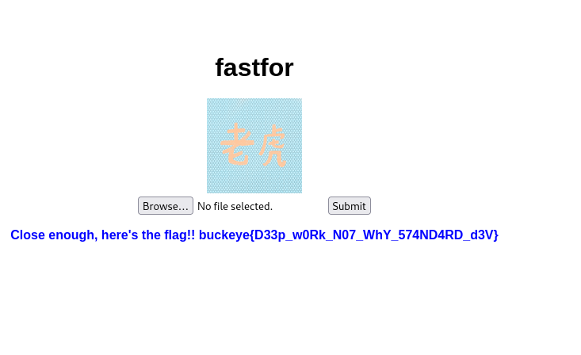

# FastFor (Crypto)

### Challenge description
Make the image different yet same!
[https://fastfor.chall.pwnoh.io](https://fastfor.chall.pwnoh.io)<br><br>
[check_hash.py](./check_hash.py)


## Solution
If we go to the website, we can see a picture and a form to submit a photo. As the chellenge descrption implies, we need to upload an image that's as same as the one in
the website, but different.
There's a Python code included in the challenge, which helps alot in understanding how we can get the flag

### check_hash.py

```python
from PIL import Image
import numpy

def check_hash(fi):
    image = numpy.asarray(Image.open('static/IMG.png'))
    submission = numpy.asarray(Image.open(fi))
    if image.shape != submission.shape:
        return False
    same = numpy.bitwise_xor(image, submission)
    if (numpy.sum(same) == 0):
        return False
    im_alt = numpy.fft.fftn(image)
    in_alt = numpy.fft.fftn(submission)
    im_hash = numpy.std(im_alt)
    in_hash = numpy.std(in_alt)
    if im_hash - in_hash < 1 and im_hash - in_hash > -1:
        return True
    return False
```
So the code takes our submitted photo and compares it with the original one, if the bytes are identical (XOR'ing 2 bits returns 0 if they are the same, so if all bits are the same then the sum of all bytes would be 0), then we don't get the flag. Then it checks if standard deviation of all of the values of the pixels in the two photos is the same, if yes, then we get the flag.

### little demonstration
In math, when we calculate the mean of some values, it won't matter the order of those values. For instance, the mean for [1, 2, 4, 6] is the same as [4, 2 ,1 6]. Same thing applies to standard deviation (to be honest I don't know how the real math works here but it was just my guess and it worked :)). Meaning that we can switch 2 values in the image that we want to submit, which will have the same standard deviation as the one in the website, but it won't be identical because we switched 2 values.

First, you have to download the image from the website.

A script to do this is as follows:
```python
import numpy as np 
from PIL import Image as im 

#First, you have to download the image from the website. store it as "IMG.png" or whatever you're comfortable with

a = np.arange(0, 2560000, 1, np.uint8) # make a numpy array from the range of 0 to 2560000, size of 1 byte, datatype unsigned integer 8 bits
a = np.reshape(a, (1600, 1600)) # reshape this array to be 1600x1600 which is the resolution of the original photo


hi = np.array(im.open("IMG.png")) # make an numpy array of 'IMG.png' image 

#Swap the two neighbouring values of the first row, first column, between blue and alpha values (r, g, b, a)
temp = hi[0][1][2]
hi[0][1][2] = hi[0][1][3]
hi[0][1][3] = temp

d = im.fromarray(hi) # make store the resulting image in variable d
d.save("test.png") # save the image as 'test.png'
```
Now we have our **test.png** image.


Upload it to the website.

BAM we got the flag


## The flag is buckeye{D33p_w0Rk_N07_WhY_574ND4RD_d3V}