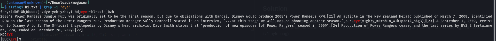

# Megaxor (Crypto)

### chall description
Some pesky wizard stole the article I was writing. I got it back, but it's all messed up now :(

Hint: the wizard used the same magic on every character...

## Solution
So we're given a file **megaxord.txt**, which is a bunch of bytes. From the name of the challenge, we need to use XOR, but there's no clue what the value of the key is.
So our solution would be bruteforcing keys from 0 to 255 (hoping that the key is 1-byte long)

### XOR bruteforce script
```python
f = open("megaxord.txt", 'rb') # Open the challenge file and read it as binary
s = f.read()# store all bytes in variable s
f.close()
ff = open("hi.txt", "a") # This file is to store the results

for i in range(0, 256): # iterate over all possible values in 1-byte
	ff.write("".join([chr(int(j)^i) for j in s])) #append the result from XOR'ing all bytes from 'megaxord.txt' file to our new file 'new.txt' as characters 
```
Now we have the file **'hi.txt'**, but it has a TON of characters. So let's run strings and find the flag

```shell
strings hi.txt | grep -i "eye" -n
```


## The flag is buckeye{m1gh7y_m0rph1n_w1k1p3d14_p4g3}
